# **Assignment 2: GitHub Basics & Collaboration**

## **Objective**
This assignment is designed to help understand how to use **GitHub for basic collaboration**, including repository setup, branching, committing, pushing, and pulling changes.

---

## **Tasks**

### **1. Create a GitHub Account (if you don't have one):**
✅ As the GitHub account is already created, this step is skipped.

---

### **2. Create a New Repository on GitHub:**
We created a new repository named **"Easy_Assignment_2"** on GitHub.  
During creation, the option **“Add a README file”** was selected to initialize the repository with a `README.md`.

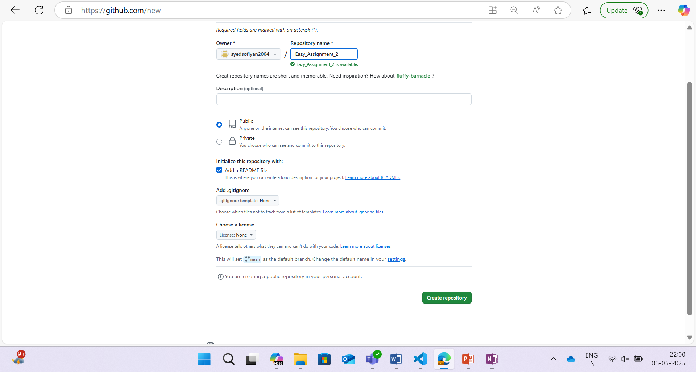

After creation, the repository appeared successfully with a `README.md` file.

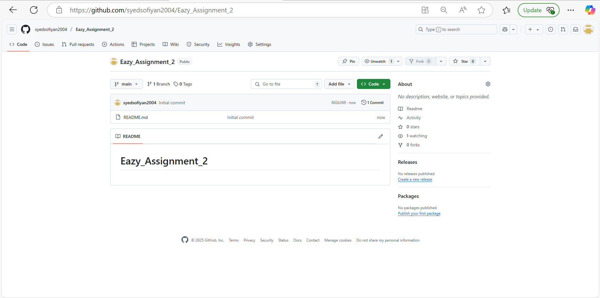

---

### **3. Push Local Repository to GitHub:**
We now push our local repository (from Assignment 1) to the GitHub repository.

- Stage all files:
```sh
git add .
```

- Commit the changes:
```sh
git commit -m "Assignment 1 complete"
```

- Push to the `master` branch on GitHub:
```sh
git push -u origin master
```

This uploads the local code to GitHub.

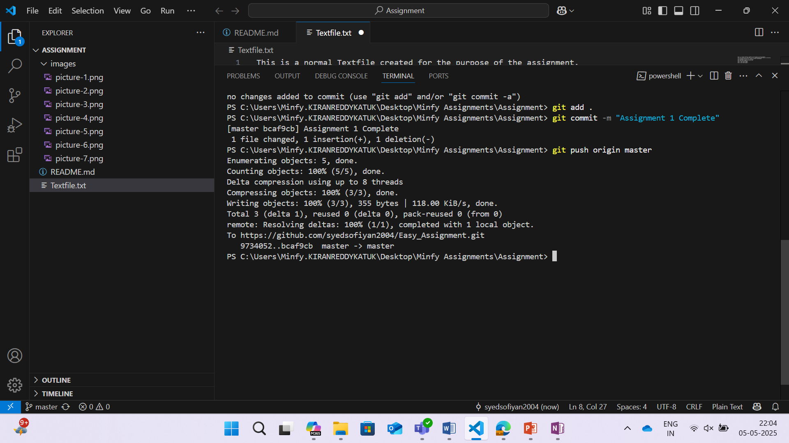  
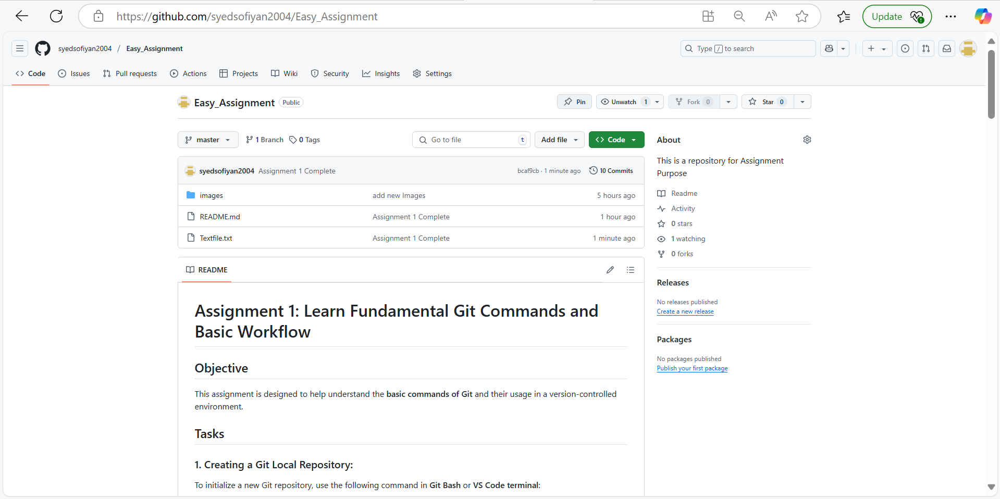

---

### **4. Create a README.md File Using GitHub Web Interface:**
 Already completed in Step 2 while creating the repository.

---

### **5. Pull the Changes to Local Repository:**
To download the remote repository into a local folder:

- First, initialize an empty local Git repository:
```sh
git init
```

- Pull the repository from GitHub using:
```sh
git pull https://github.com/syedsofiyan2004/Easy_Assignment_2
```

This command fetches the remote content and integrates it into your local repo.

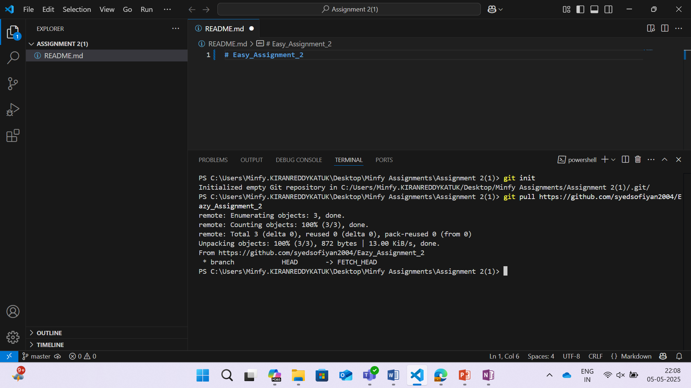

---

### **6. Create a New Branch Locally Named `feature/update-readme`:**

- Create the new branch:
```sh
git branch feature/update-readme
```

- Switch to the newly created branch:
```sh
git checkout feature/update-readme
```

Now we're working in the `feature/update-readme` branch.

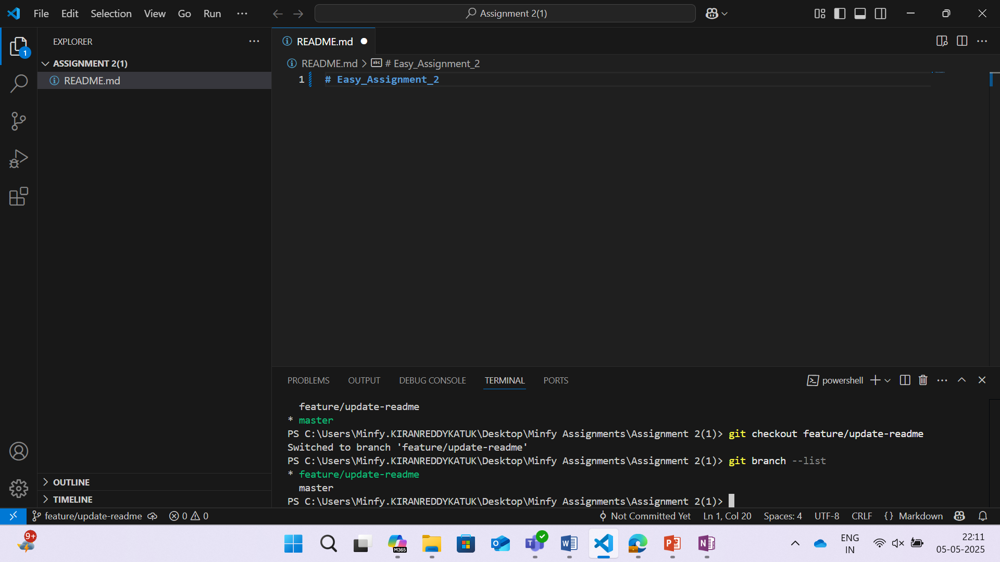  
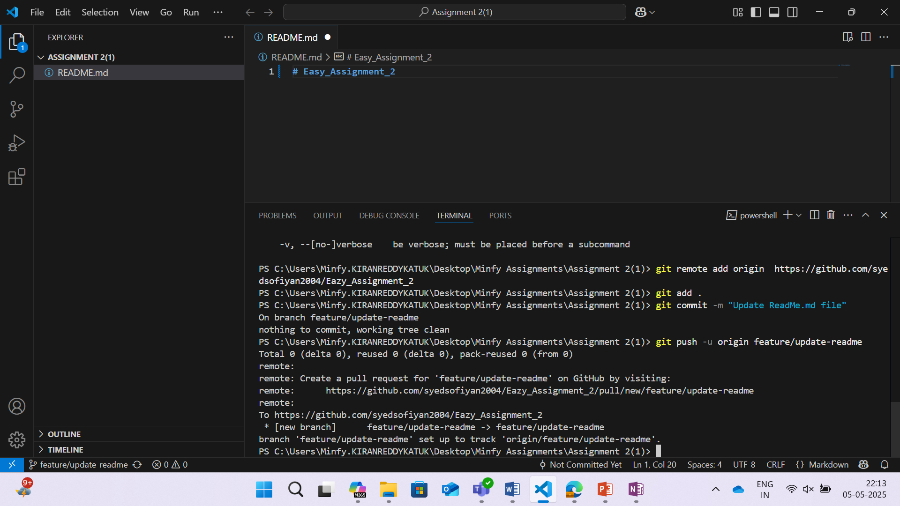

---

### **7. Make Changes to `README.md` and Push the Branch to GitHub:**

- Stage the updated file:
```sh
git add .
```

- Commit the changes:
```sh
git commit -m "Update ReadMe.md file"
```

- Push the changes to the new branch on GitHub:
```sh
git push origin feature/update-readme
```

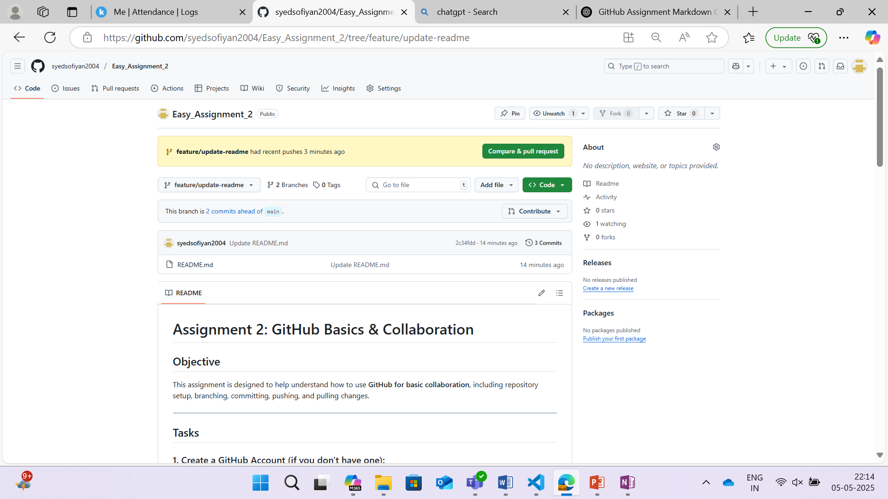

### **8.Create a pull request from "feature/update-readme" to main branch:**
Now we can create a pull request manually in the GitHub as shown in the image by pressing the create pull request button as shown in the image:
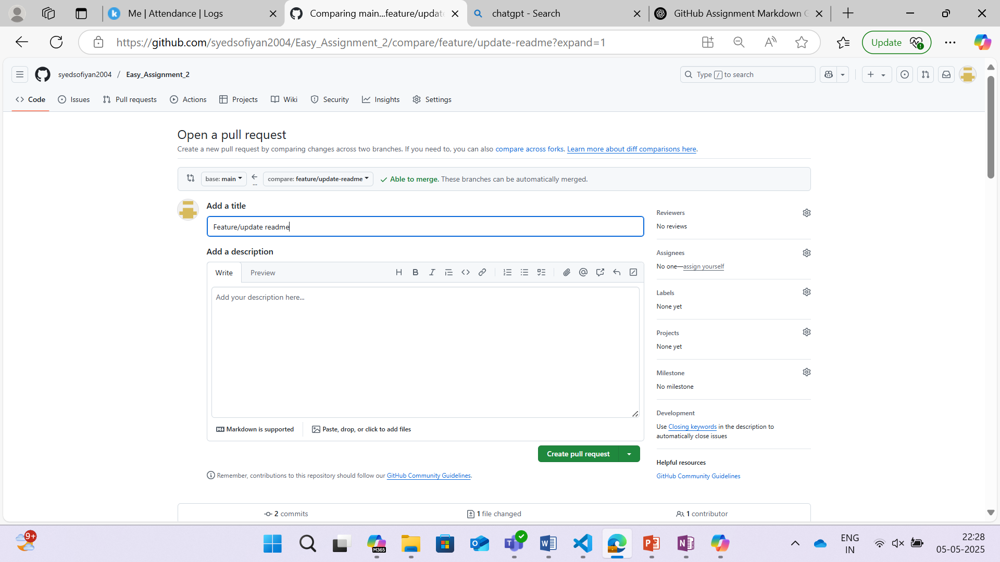

### **9.	Review and merge the pull request:**
After we create a pull request it will automatically will create a merge pull request as shown in the image:
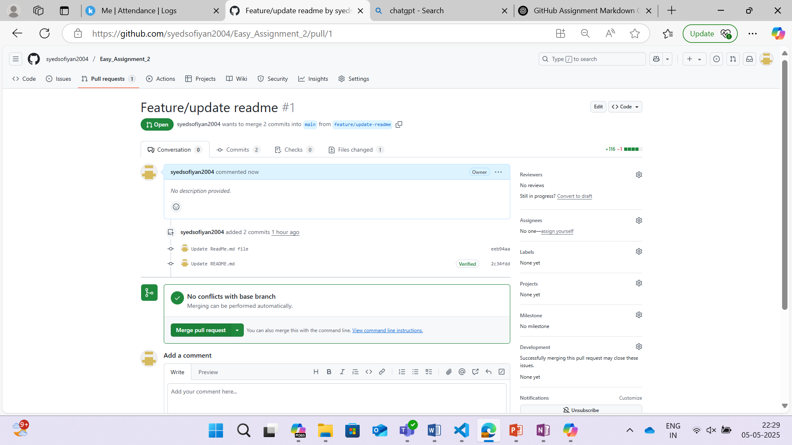
after merging a pull request we can see that it is successfully Merged as shown in the image:
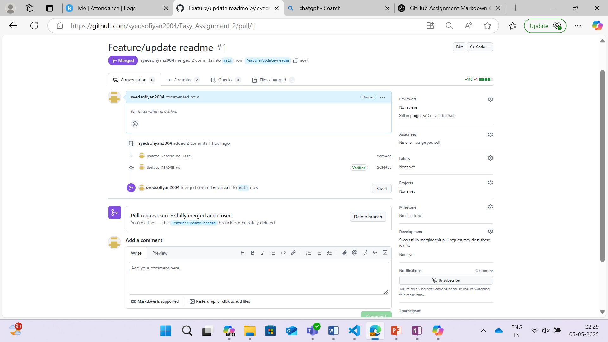
We have successfully Merged the content of feature/update-readme branch to main branch:
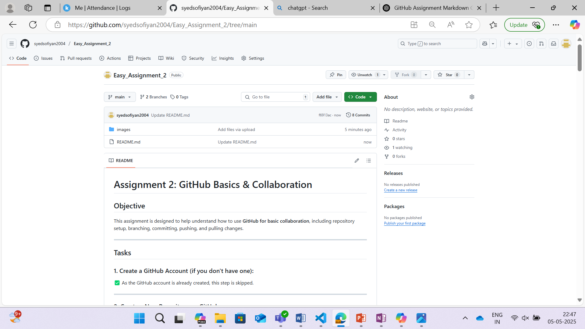

---

**Successfully Completed Assignment 2**
